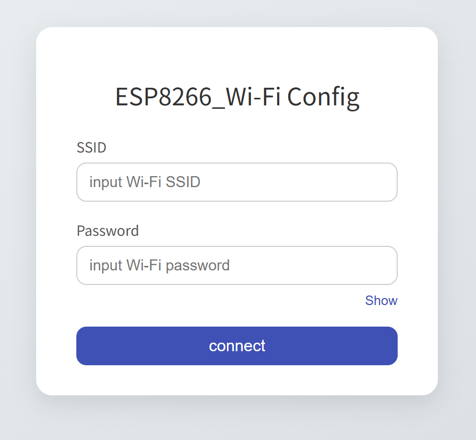

# ESP8266 Web 配网示例
实现ESP8266简单的基本Web配网页面
  

## 环境
硬件：ESP8266  
软件：VS Code+PLatformIO  
库依赖：Arduino.h、ESP8266WiFi.h、WiFiClient.h、ESP8266WebServer.h、ESP8266mDNS.h
调用硬件引脚：LED_BUILTIN

## 工作流程
1.设备启动后以STA模式尝试连接已有的Wi-Fi（尝试10次）  
2.若失败，LED闪烁，自动开启AP_STA模式，默认SSID:ESP8266,默认密码：12345678  
3.在192.168.4.1或esp8266.local（mDNS，可能存在兼容性问题）访问配网页面  
4.提交Wi-Fi信息后若连接成功，自动关闭AP，联网完成  

## 调试  
串口波特率115200